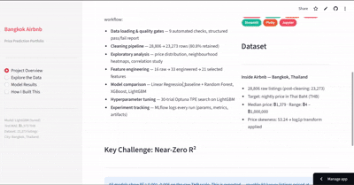

# Airbnb Price Predictor

> End-to-end ML pipeline that predicts nightly Airbnb prices for Bangkok listings — from raw CSV to a live interactive dashboard.

**[Live Demo →](https://airbnb-price-prediction-j8xe3rfxndfexv3nu6kvxs.streamlit.app/)** &nbsp;|&nbsp; Python 3.9 &nbsp;|&nbsp; LightGBM + Optuna &nbsp;|&nbsp; MLflow &nbsp;|&nbsp; Streamlit



---

## Table of Contents

1. [Project Overview](#project-overview)
2. [Architecture](#architecture)
3. [Results](#results)
4. [Tech Stack](#tech-stack)
5. [Setup & Installation](#setup--installation)
6. [How to Run](#how-to-run)
7. [Feature Engineering](#feature-engineering)
8. [Key Decisions & Lessons](#key-decisions--lessons)
9. [File Structure](#file-structure)

---

## Project Overview

### The Problem

Bangkok hosts on Airbnb have no systematic tool to price a new listing. They either guess based on nearby properties or underprice to get their first reviews — leaving money on the table or pricing themselves out of the market entirely.

### End User

A Bangkok Airbnb host setting up a new listing who wants a data-driven starting price given their room type, neighbourhood, availability policy, and listing quality.

### The Data

**Source:** [Inside Airbnb](http://insideairbnb.com/) — Bangkok, Thailand

| | Raw | After cleaning |
|---|---|---|
| Listings | 28,806 | 23,273 (80.8% retained) |
| Columns | 18 | 16 |
| Target | `price` (THB/night) | same |
| Median price | — | ฿1,379 |
| Price range | — | ฿4 – ฿1,000,000 |

Two columns (`neighbourhood_group`, `license`) were 100% null and dropped. Price-null rows (19.2%) were removed. Reviews for never-reviewed listings (~35%) were imputed to 0.

### What the Model Outputs

Given a listing's characteristics, the model predicts **nightly price in Thai Baht (THB)**. Predictions are made in log space (log1p transform) and automatically inverted back to THB, so `model.predict()` always returns interpretable values.

### Key Design Decision: Why MAE, Not R²

All five models show R² ≈ 0.001–0.006. This is not a failure — it is an artefact of roughly 50 luxury listings priced at ฿1,000,000 dominating the total sum of squares. R² measures variance explained; those outliers set the denominator so high that even accurate predictions on the remaining 23,000 listings look like noise.

**MAE is the right metric here.** It directly answers the question a host cares about: *"How wrong will this prediction be in Thai Baht?"* The best model's MAE of ฿1,573 against a median price of ฿1,379 is a meaningful, honest signal.

---

## Architecture

```
Raw CSV (28,806 rows)
        |
        v
  Quality Gate          9 automated checks — null rates, bounds, skew, outliers
  (quality.py)          Returns structured {success, failures, warnings, statistics}
        |
        v
   Data Cleaner         Drop 100%-null cols, remove price-nulls, impute reviews
   (cleaner.py)         28,806 -> 23,273 rows (80.8% retained)
        |
        v
  EDA Notebook          Price distribution, room-type analysis, neighbourhood
  (eda.ipynb)           heatmaps, correlation study
        |
        v
Feature Engineering     16 raw columns -> 33 engineered -> 21 selected
 (engineering.py)       Domain, NLP, statistical transforms, interaction features
        |
   _____|_____
  |           |
  v           v
Baseline    Candidates              All models wrapped in
(Linear     (RF, XGBoost,           TransformedTargetRegressor
Regression) LightGBM)               (log1p / expm1)
  |           |
  |           v
  |      Optuna Tuning              30-trial TPE search
  |      (tuning.py)                9 hyperparameters, 5-fold CV
  |           |
  |___________|
        |
        v
  MLflow Tracking        Params, metrics (MAE, RMSE, R2, Adj R2),
 (run_training.py)       fit time, model artifacts -- every run logged
        |
        v
production_model.pkl     Best model by test MAE (LightGBM tuned)
        |
        v
  Streamlit App          4-page portfolio dashboard -- EDA explorer,
(streamlit_app.py)       model comparison, feature importance, live predictor
```

---

## Results

### Model Comparison

| Model | Type | CV MAE | CV Std | Test MAE | Test RMSE | Test R² | Adj R² | Fit (s) |
|---|---|---|---|---|---|---|---|---|
| Linear Regression | Baseline | — | — | ฿1,693 | ฿19,824 | 0.0006 | -0.0039 | 0.25 |
| Random Forest | Candidate | ฿1,424 | ±161 | ฿1,580 | ฿19,802 | 0.0028 | -0.0017 | 1.80 |
| XGBoost | Candidate | ฿1,416 | ±159 | ฿1,575 | ฿19,778 | 0.0052 | +0.0007 | 1.30 |
| LightGBM (default) | Candidate | ฿1,406 | ±158 | ฿1,560 | ฿19,794 | 0.0036 | -0.0009 | 0.70 |
| **LightGBM (tuned)** | **Winner** | **฿1,415** | **—** | **฿1,573** | **฿19,770** | **0.0061** | **+0.0016** | 2.24 |

**Improvement over baseline:** ฿1,693 → ฿1,573 MAE = **−7.1%**

### Why LightGBM (tuned) Wins

- Fastest default training (0.7 s) → selected for Optuna hyperparameter search
- Best cross-validated MAE among default-param models (฿1,406)
- After 30-trial Optuna TPE search: best overall R² (0.0061), Adj R² (+0.0016), and RMSE (฿19,770)
- Tuned test MAE (฿1,573) is within noise of default (฿1,560), confirming default params were already near-optimal — the tuning run is evidence, not wasted compute

### Optuna Tuning Summary

```
Trials:    30  (TPE sampler)
CV folds:  5
Best trial: #27

Hyperparameters found:
  n_estimators       740
  learning_rate      0.0372
  num_leaves         125
  max_depth          9
  min_child_samples  76
  subsample          0.843
  colsample_bytree   0.697
  reg_alpha          0.020
  reg_lambda         0.024
```

---

## Tech Stack

| Tool | Purpose |
|---|---|
| **Python 3.9** | Core language |
| **Pandas / NumPy** | Data loading, cleaning, feature engineering, numerical transforms |
| **scikit-learn** | Pipelines, `TransformedTargetRegressor`, metrics, train/test split |
| **LightGBM** | Production model — gradient boosting on decision trees |
| **XGBoost** | Candidate model in comparison study |
| **Optuna** | Hyperparameter search (TPE sampler, 30 trials, 5-fold CV) |
| **MLflow** | Experiment tracking — params, metrics, and model artifacts per run |
| **Streamlit** | Interactive 4-page portfolio dashboard |
| **Plotly** | Interactive charts (histograms, scatter, box plots, bar charts) |
| **Jupyter** | EDA notebook (7 sections, price/neighbourhood/correlation analysis) |
| **pytest** | 50 unit + integration tests across 3 test files |
| **flake8** | Linting (`max-line-length=120`, alignment exemptions in `.flake8`) |
| **Docker** | Containerised deployment (`python:3.9-slim` base image) |
| **GitHub Actions** | CI: test + lint jobs on every push to `main` and all PRs |

---

## Setup & Installation

### Prerequisites

- Python 3.9+
- Git
- Docker Desktop (optional, for containerised deployment)

### Clone and Install

```bash
git clone https://github.com/Saahithi-Chippa/airbnb-price-prediction
cd airbnb-price-prediction

# Install Python dependencies
pip install -r requirements.txt

# Install the src/ package in editable mode (makes src imports work)
pip install -e .
```

### Data

Place the Inside Airbnb Bangkok listings CSV in `data/`:

```
data/
  listings.csv    <- download from http://insideairbnb.com/get-the-data/
```

> **No data? No problem.** The app ships with a **demo mode**: if training artifacts are missing, every page renders using synthetic data that mirrors the real Bangkok distribution. You can explore all four pages without running a single training script.

---

## How to Run

### Full Training Pipeline

Run the steps in order. Each script is independent and saves its output to `data/` or `models/`.

```bash
# 1. Load and profile the raw data
python src/data/loader.py

# 2. Run 9-check quality gate
python src/data/quality.py

# 3. Clean: drop nulls, impute, save data/cleaned.csv
python src/data/cleaner.py

# 4. Engineer and select features, save data/features.csv
python src/features/run_features.py

# 5. Train baseline (LinearRegression)
python src/models/baseline.py

# 6. Compare candidate models (RF, XGBoost, LightGBM)
python src/models/train.py

# 7. Optuna hyperparameter search (~14 min), save models/best_params.json
python src/models/tuning.py

# 8. MLflow-tracked training run, save models/production_model.pkl
python src/models/run_training.py

# 9. Generate test-set predictions, save data/predictions.csv
python src/models/predict.py
```

### Streamlit Dashboard

```bash
streamlit run app/streamlit_app.py
# Open http://localhost:8501
```

The dashboard has four pages:

| Page | Contents |
|---|---|
| **Project Overview** | KPI cards, project narrative, tech stack badges, R² explanation |
| **Explore the Data** | Interactive EDA — room type / price / neighbourhood filters, correlation chart |
| **Model Results** | Comparison table, feature importance, residual plot, live price predictor form |
| **How I Built This** | Pipeline diagram, 8-stage build timeline, key design decisions, quickstart code |

### MLflow UI

```bash
mlflow server --host 127.0.0.1 --port 5000 \
  --backend-store-uri file:///C:/Users/<you>/mlruns
# Open http://localhost:5000
```

### Docker

```bash
# Build the image
docker build -t my-ml-project .

# Run the container
docker run -p 8501:8501 my-ml-project

# Or with docker compose (mounts data/ and models/ as live volumes)
docker compose up --build
# Open http://localhost:8501
```

### Tests

```bash
# Run all 50 tests with verbose output
pytest tests/ -v

# Run a single file
pytest tests/test_model.py -v
```

| File | Tests | Coverage |
|---|---|---|
| `test_data_quality.py` | 14 | Pass on clean data; fail on missing columns, negative prices, critical null rates, out-of-bounds values |
| `test_features.py` | 22 | Column count (+17 new), no NaNs (incl. null-name and zero-availability edge cases), value ranges, keyword detection |
| `test_model.py` | 14 | Model loads, predict shape, positive predictions, in-range, entire home > private room, luxury > standard |

---

## Feature Engineering

Starting from 16 raw columns, the pipeline engineers 17 new features (33 total), then selects 21 via two-pass filtering.

### Top 10 Features by Importance (LightGBM gain)

| Rank | Feature | Category | Rationale |
|---|---|---|---|
| 1 | `host_scale_score` | Interaction | `log1p(listings_count) × availability_rate` — commercial hosts with managed calendars price strategically above-market |
| 2 | `min_nights_availability_ratio` | Interaction | High minimum stay relative to open availability flags long-term rental targeting, a different price elasticity |
| 3 | `availability_rate` | Domain | `availability_365 / 365` — continuous signal; passive listings with erratic calendars price inconsistently |
| 4 | `name_length` | NLP | Character count of listing title; longer, richer descriptions correlate with host effort and listing quality |
| 5 | `days_since_last_review` | Domain | Recency proxy for active management; capped at 730 days (sentinel 9999 inflated variance 50,000×) |
| 6 | `demand_index` | Interaction | `reviews_per_month × availability_rate` — captures achievable bookings, not just activity or openness alone |
| 7 | `reviews_per_month` | Raw | Direct booking velocity signal |
| 8 | `name_word_count` | NLP | Word count of listing title; richer descriptions target higher-paying guests |
| 9 | `number_of_reviews` | Raw | Cumulative social proof; high-review listings command tighter, above-floor pricing |
| 10 | `minimum_nights` | Raw | Long-stay requirements shift the competitive set from tourists to corporate renters |

### Feature Selection Pipeline

```
33 numeric columns
      |
      | Pass 1: Correlation filter  (|Pearson r| > 0.95)
      |   Dropped: availability_365                  r=1.00 with availability_rate
      |            calculated_host_listings_count    r=0.97 with host_scale_score
      v
31 columns
      |
      | Pass 2: Variance filter  (< 1% of median feature variance)
      |   Dropped: latitude   var=0.0016
      |            longitude  var=0.0024
      v
21 selected features
```

Using **median** variance as the reference is deliberate — one high-scale column inflating the mean would eliminate every binary flag in the dataset.

---

## Key Decisions & Lessons

**1. Log1p target transform is non-negotiable**
Price skewness of 53.24 (mean ฿2,529 vs median ฿1,379) means a linear model trained on raw prices is essentially fitting a near-constant target. Wrapping every model in scikit-learn's `TransformedTargetRegressor(func=np.log1p, inverse_func=np.expm1)` keeps the interface clean: `model.predict()` always returns THB, and the transform is never accidentally forgotten downstream.

**2. MAE beats R² on a heavy-tailed target**
Roughly 50 luxury listings at ฿1,000,000 make R² near-zero even for useful models. Reporting only R² would make the project look like a failure to anyone unfamiliar with the dataset. Framing the primary KPI as MAE — *"how wrong in Thai Baht"* — gives a number a host can actually interpret and a recruiter can evaluate at a glance.

**3. Tuning confirmed the default was already near-optimal (and that's a valid result)**
Thirty Optuna trials took ~14 minutes. The tuned model's test MAE (฿1,573) was slightly *worse* than the default's (฿1,560) on the held-out set. This is a legitimate finding — the gap is smaller than the variance of a single 80/20 split. The tuning run is evidence that LightGBM's default hyperparameters are well-calibrated for this kind of tabular dataset.

**4. A variance filter using the mean failed silently — and wiped out all features**
The first implementation of `select_features()` used `mean()` as the variance reference. A 9999 sentinel value in `days_since_last_review` inflated the mean variance by ~50,000×, causing the threshold to exceed every other feature and drop the entire feature set. The fix was two lines: cap `days_since_last_review` at 730 days and switch the reference from `mean()` to `median()`. The lesson: sentinel values corrupt distributional statistics; always cap or impute before computing moments.

**5. MLflow must live outside OneDrive on Windows**
Storing `mlruns/` inside a OneDrive-synced folder caused intermittent `PermissionError` — OneDrive's sync client holds a write lock on files it is uploading, and MLflow reads the same param file it just wrote. Moving `MLRUNS_DIR = Path.home() / "mlruns"` (outside the sync boundary) resolved it completely. The same issue occurs with Dropbox and Google Drive.

---

## File Structure

```
airbnb-price-prediction/
|
|-- app/
|   `-- streamlit_app.py        # 4-page Streamlit portfolio dashboard
|                               # demo mode: synthetic data when artifacts absent
|
|-- data/                       # gitignored — generated by pipeline
|   |-- listings.csv            # raw Inside Airbnb download
|   |-- cleaned.csv             # output of cleaner.py
|   |-- features.csv            # output of run_features.py
|   |-- predictions.csv         # output of predict.py
|   `-- model_results.json      # static model comparison table (committed)
|
|-- models/                     # gitignored — generated by training
|   |-- best_params.json        # Optuna best hyperparameters (committed)
|   |-- production_model.pkl    # best model by test MAE
|   `-- *.pkl                   # intermediate model checkpoints
|
|-- notebooks/
|   `-- eda.ipynb               # 7-section exploratory analysis notebook
|
|-- src/
|   |-- data/
|   |   |-- loader.py           # CSV loading and profiling utilities
|   |   |-- quality.py          # 9-check automated quality gate
|   |   `-- cleaner.py          # cleaning pipeline -> data/cleaned.csv
|   |
|   |-- features/
|   |   |-- engineering.py      # create_features() and select_features()
|   |   `-- run_features.py     # orchestrates full feature pipeline
|   |
|   `-- models/
|       |-- baseline.py         # LinearRegression performance floor
|       |-- train.py            # RF / XGBoost / LightGBM candidate comparison
|       |-- tuning.py           # Optuna 30-trial TPE hyperparameter search
|       |-- run_training.py     # MLflow-tracked final training run
|       `-- predict.py          # generates data/predictions.csv
|
|-- tests/
|   |-- test_data_quality.py    # 14 tests: quality gate pass/fail scenarios
|   |-- test_features.py        # 22 tests: column count, NaN safety, ranges
|   `-- test_model.py           # 14 tests: load, predict, sanity checks
|
|-- .flake8                     # flake8 config (max-line-length=120)
|-- .github/
|   `-- workflows/
|       `-- ci.yml              # CI: pytest + flake8 on push/PR to main
|-- .gitignore                  # excludes data/, models/, mlruns/, __pycache__
|-- docker-compose.yml          # Streamlit on port 8501, data/models as volumes
|-- Dockerfile                  # python:3.9-slim, installs deps, exposes 8501
|-- requirements.txt            # all Python dependencies
|-- setup.py                    # makes src/ importable as a package (pip install -e .)
`-- README.md
```

---

## CI Status

Every push to `main` and every pull request runs two GitHub Actions jobs in parallel:

- **Test** — `pytest tests/ -v` on Python 3.9 / ubuntu-latest (50 tests)
- **Lint** — `flake8 src/ app/` with project `.flake8` config

---

*Built by [Saahithi Chippa](https://github.com/Saahithi-Chippa) · Bangkok Airbnb Price Prediction*
